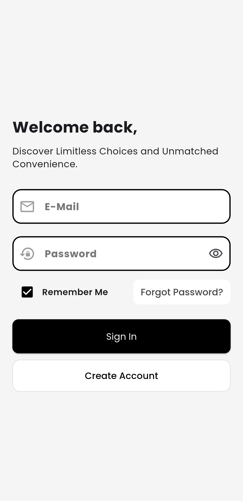
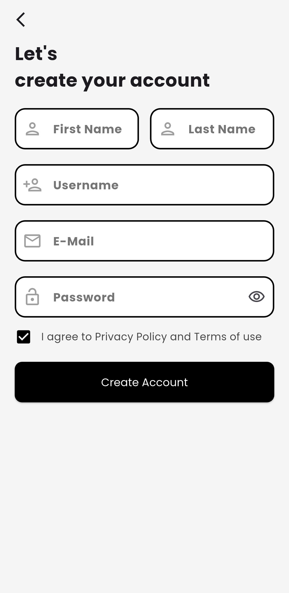
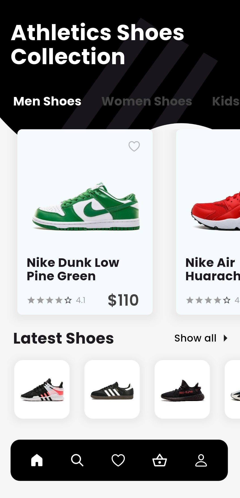
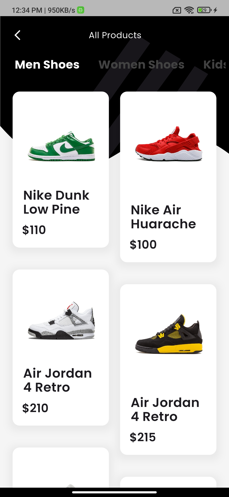
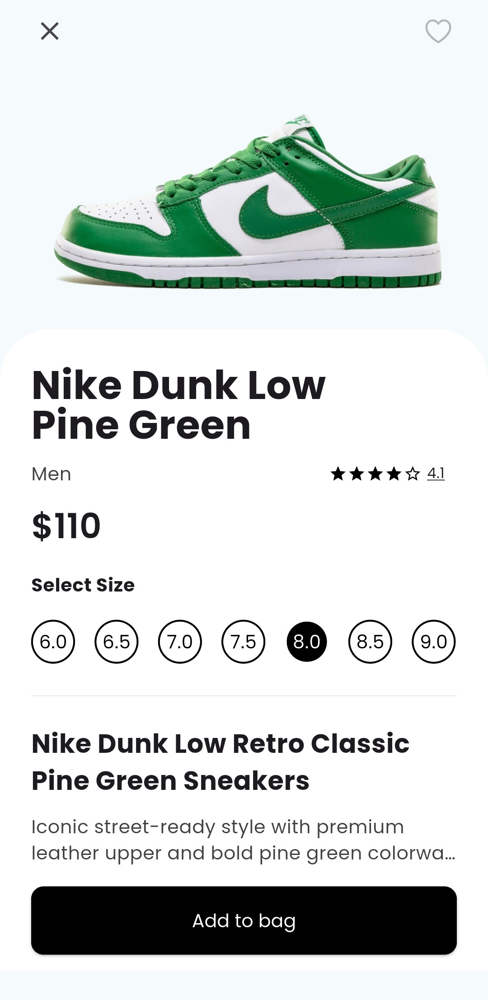
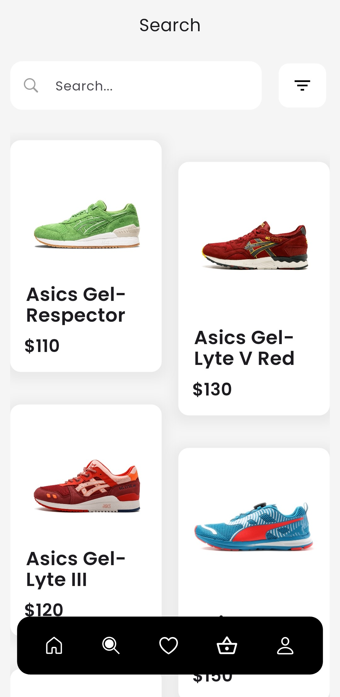
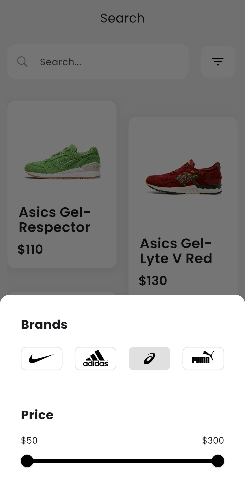
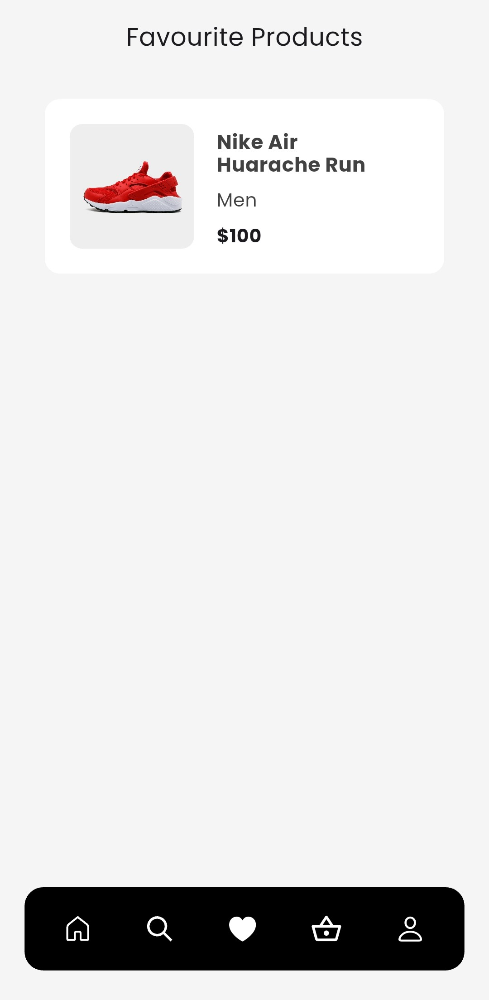
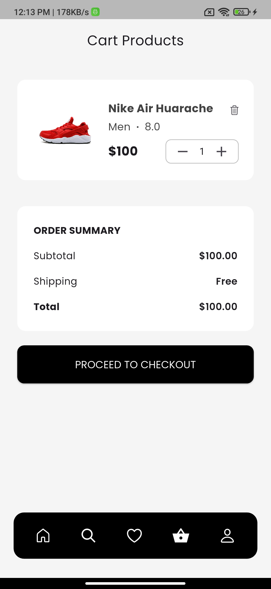

# Severance

A full-stack e-commerce shoe store application built with **Flutter**, **Node.js**, **Express.js**, **MongoDB**, and **GetX**. The app provides a clean and minimal shopping experience with secure authentication, wishlist, cart management, and a modern user interface.

---

## Features

- JWT Authentication
- Browse Shoes
- Wishlist Management
- Shopping Cart
- Shoe Size Selection
- REST API Integration
- Minimal & Modern UI
- Backend Deployed on Render

---

## Tech Stack

### Frontend
- Flutter
- GetX
- SharedPreferences
- Cached Network Image

### Backend
- Node.js
- Express.js
- MongoDB Atlas
- JWT Authentication
- Render

---

# Screenshots

<table align="center">
  <tr>
    <td align="center">
      <br>
      <b>Login</b>
    </td>
    <td align="center">
      <br>
      <b>Register</b>
    </td>
    <td align="center">
      <br>
      <b>Home</b>
    </td>
  </tr>

  <tr>
    <td align="center">
      <br>
      <b>All Products</b>
    </td>
    <td align="center">
      <br>
      <b>Product Detail</b>
    </td>
    <td align="center">
      <br>
      <b>Search</b>
    </td>
  </tr>
  
  <tr>
    <td align="center">
      <br>
      <b>Search Filter</b>
    </td>
    <td align="center">
      <br>
      <b>Wishlist</b>
    </td>
    <td align="center">
      <br>
      <b>Cart</b>
    </td>
  </tr>
</table>

## Getting Started

### Clone the repository

```bash
git clone https://github.com/your-username/severance.git
```

### Flutter

```bash
flutter pub get
flutter run
```

### Backend

```bash
npm install
npm start
```

---

## Future Improvements

- Order Management
- Payment Gateway Integration
- Push Notifications
- Product Reviews
- User Profile Management

---

## License

This project is built for learning and portfolio purposes.
